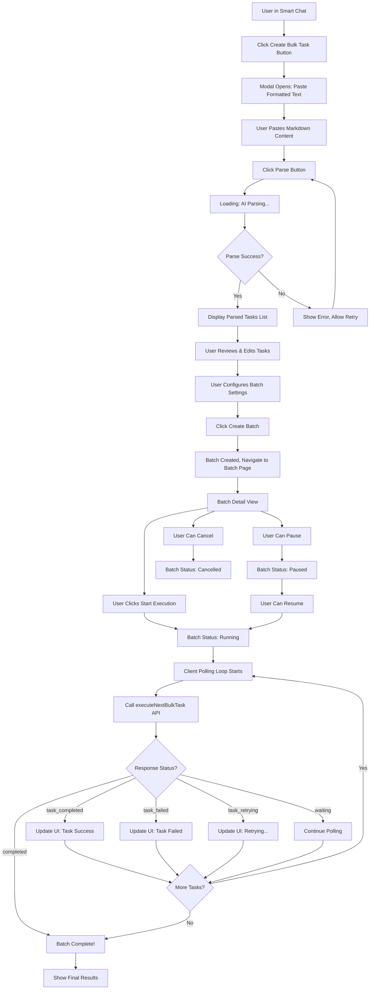

# Bulk Task System Architecture

## Executive Summary

This document outlines the comprehensive architecture for a bulk task system integrated into the existing smart chat application. The system enables users to paste formatted requirements (e.g., card image prompts), have AI parse them into individual tasks, configure execution parameters, and execute them in batches with rate limiting.

## 1. Data Models & TypeScript Interfaces

### 1.1 TypeScript Types (`src/types/bulkTask.ts`)

```typescript
// Task status lifecycle
export type BulkTaskStatus =
  | "pending" // Task created but not started
  | "queued" // Task is in queue waiting for execution
  | "processing" // Task is currently being executed
  | "completed" // Task completed successfully
  | "failed" // Task failed with error
  | "cancelled"; // Task was manually cancelled

// Batch status lifecycle
export type BatchStatus =
  | "draft" // Batch created, tasks being edited
  | "ready" // Batch ready for execution
  | "running" // Batch is actively executing
  | "paused" // Batch execution paused by user
  | "completed" // All tasks completed
  | "cancelled"; // Batch cancelled by user

// Individual task within a batch
export interface BulkTask {
  id: string; // Unique task ID
  batchId: string; // Parent batch ID
  prompt: string; // Combined prompt (prefix + specific)
  prefix?: string; // Optional prefix applied
  specificPrompt: string; // The actual task-specific prompt
  order: number; // Execution order within batch
  status: BulkTaskStatus;
  createdAt: number; // Timestamp
  startedAt?: number; // When execution started
  completedAt?: number; // When execution completed
  result?: {
    imageKey?: string; // S3 key if image generation
    textResponse?: string; // Text response if applicable
    error?: string; // Error message if failed
  };
  retryCount: number; // Number of retry attempts
  metadata?: {
    category?: string; // Optional categorization
    level?: string; // For leveled items (e.g., "Level 1")
    tags?: string[]; // Custom tags
  };
}

// Batch configuration
export interface BatchConfig {
  delayBetweenTasks: number; // Milliseconds between task executions
  maxConcurrentTasks: number; // Max tasks to run in parallel (1 for sequential)
  retryOnFailure: boolean; // Whether to retry failed tasks
  maxRetries: number; // Maximum retry attempts per task
  imageSettings?: {
    // Image generation settings
    aspectRatio: string;
    resolution: string;
    model: string;
  };
  autoResume: boolean; // Resume on app reload
}

// Complete batch of tasks
export interface BulkTaskBatch {
  batchId: string; // Unique batch ID
  userId: string; // Owner user ID
  sessionId?: string; // Associated smart chat session (optional)
  title: string; // User-friendly batch title
  description?: string; // Optional description
  status: BatchStatus;
  config: BatchConfig;
  tasks: BulkTask[]; // Array of all tasks in batch
  createdAt: number;
  updatedAt: number;
  startedAt?: number; // When batch execution started
  completedAt?: number; // When batch execution completed
  progress: {
    total: number; // Total tasks
    pending: number;
    processing: number;
    completed: number;
    failed: number;
    cancelled: number;
  };
  rawInput?: string; // Original pasted text (for re-parsing)
}

// API Response Types
export interface CreateBatchResponse {
  success: boolean;
  batch: BulkTaskBatch;
}

export interface ParsePromptsRequest {
  userId: string;
  rawText: string; // The pasted markdown text
  prefixPrompt?: string; // Optional prefix to apply to all
}

export interface ParsePromptsResponse {
  success: boolean;
  tasks: Array<{
    prompt: string;
    specificPrompt: string;
    prefix?: string;
    order: number;
    metadata?: {
      category?: string;
      level?: string;
      tags?: string[];
    };
  }>;
  totalTasks: number;
}

export interface GetBatchResponse {
  success: boolean;
  batch: BulkTaskBatch;
}

export interface ListBatchesResponse {
  success: boolean;
  batches: BulkTaskBatch[];
  lastKey?: any;
}

export interface ExecuteBatchRequest {
  userId: string;
  batchId: string;
}

export interface ExecuteBatchResponse {
  success: boolean;
  message: string;
}

export interface UpdateBatchConfigRequest {
  userId: string;
  batchId: string;
  config: Partial<BatchConfig>;
}

export interface UpdateTasksRequest {
  userId: string;
  batchId: string;
  tasks: BulkTask[];
}
```

## 2. DynamoDB Schema

### 2.1 Table: `BulkTaskBatches`

**Purpose:** Store bulk task batch metadata and configuration

**Primary Key:**

- Partition Key: `userId` (String)
- Sort Key: `batchId` (String)

**Attributes:**

```
{
  userId: String,
  batchId: String,
  sessionId: String (optional),
  title: String,
  description: String (optional),
  status: String, // draft | ready | running | paused | completed | cancelled
  config: Map {
    delayBetweenTasks: Number,
    maxConcurrentTasks: Number,
    retryOnFailure: Boolean,
    maxRetries: Number,
    imageSettings: Map {
      aspectRatio: String,
      resolution: String,
      model: String
    },
    autoResume: Boolean
  },
  progress: Map {
    total: Number,
    pending: Number,
    processing: Number,
    completed: Number,
    failed: Number,
    cancelled: Number
  },
  createdAt: Number,
  updatedAt: Number,
  startedAt: Number (optional),
  completedAt: Number (optional),
  rawInput: String (optional)
}
```

**GSI: `status-createdAt-index`**

- Partition Key: `status`
- Sort Key: `createdAt`
- Purpose: Query batches by status

### 2.2 Table: `BulkTasks`

**Purpose:** Store individual tasks within batches

**Primary Key:**

- Partition Key: `batchId` (String)
- Sort Key: `taskId` (String)

**Attributes:**

```
{
  batchId: String,
  taskId: String,
  userId: String, // Denormalized for access control
  prompt: String,
  prefix: String (optional),
  specificPrompt: String,
  order: Number,
  status: String, // pending | queued | processing | completed | failed | cancelled
  createdAt: Number,
  startedAt: Number (optional),
  completedAt: Number (optional),
  result: Map {
    imageKey: String (optional),
    textResponse: String (optional),
    error: String (optional)
  },
  retryCount: Number,
  metadata: Map {
    category: String (optional),
    level: String (optional),
    tags: List<String> (optional)
  }
}
```

**GSI: `batchId-order-index`**

- Partition Key: `batchId`
- Sort Key: `order`
- Purpose: Retrieve tasks in execution order

**GSI: `batchId-status-index`**

- Partition Key: `batchId`
- Sort Key: `status`
- Purpose: Query tasks by status within a batch

### 2.3 S3 Storage

**Bucket:** Existing `S3_BUCKET` (same as smart chat)

**Path Structure:**

```
bulk_tasks/{userId}/{batchId}/{taskId}.webp
```

**Usage:** Store generated images from bulk tasks

## 3. Backend Architecture

### 3.1 Lambda Functions (`vinpix_lambda/src/bulk_tasks.py`)

```python
# New module: vinpix_lambda/src/bulk_tasks.py

import json
import boto3
import time
import uuid
from src.utils import bulk_task_batches_table, bulk_tasks_table, S3_BUCKET, get_s3_key
import src.s3helper as s3helper
import src.aiService as ai
from boto3.dynamodb.conditions import Key

def create_batch(user_id, title, description=None, config=None, session_id=None):
    """
    Create a new bulk task batch in draft status.

    Args:
        user_id: User ID
        title: Batch title
        description: Optional description
        config: Batch configuration (uses defaults if not provided)
        session_id: Optional associated smart chat session

    Returns:
        Response with batch metadata
    """
    try:
        batch_id = str(uuid.uuid4())
        timestamp = int(time.time() * 1000)

        # Default configuration
        default_config = {
            'delayBetweenTasks': 2000,  # 2 seconds
            'maxConcurrentTasks': 1,     # Sequential by default
            'retryOnFailure': True,
            'maxRetries': 2,
            'imageSettings': {
                'aspectRatio': '1:1',
                'resolution': '1K',
                'model': 'models/imagen-4.0-generate-001'
            },
            'autoResume': False
        }

        batch_config = {**default_config, **(config or {})}

        batch = {
            'userId': user_id,
            'batchId': batch_id,
            'title': title,
            'status': 'draft',
            'config': batch_config,
            'progress': {
                'total': 0,
                'pending': 0,
                'processing': 0,
                'completed': 0,
                'failed': 0,
                'cancelled': 0
            },
            'createdAt': timestamp,
            'updatedAt': timestamp
        }

        if description:
            batch['description'] = description

        if session_id:
            batch['sessionId'] = session_id

        bulk_task_batches_table.put_item(Item=batch)

        return {
            'statusCode': 200,
            'body': {
                'success': True,
                'batch': batch
            }
        }
    except Exception as e:
        print(f"Error creating batch: {str(e)}")
        return {
            'statusCode': 500,
            'body': {'error': f'Failed to create batch: {str(e)}'}
        }

def parse_prompts(user_id, raw_text, prefix_prompt=None):
    """
    Use AI to parse structured text into individual tasks.

    The AI will analyze markdown-formatted text and extract:
    - Prefix prompts (shared across tasks)
    - Individual prompts with metadata (category, level, etc.)

    Args:
        user_id: User ID
        raw_text: The pasted markdown text
        prefix_prompt: Optional global prefix to apply to all tasks

    Returns:
        Parsed tasks array
    """
    try:
        # Define JSON schema for AI response
        task_schema = {
            "type": "object",
            "properties": {
                "prefixPrompt": {"type": "string"},
                "tasks": {
                    "type": "array",
                    "items": {
                        "type": "object",
                        "properties": {
                            "prompt": {"type": "string"},
                            "category": {"type": "string"},
                            "level": {"type": "string"},
                            "tags": {
                                "type": "array",
                                "items": {"type": "string"}
                            }
                        },
                        "required": ["prompt"]
                    }
                }
            },
            "required": ["tasks"]
        }

        system_prompt = """You are an expert at parsing structured text into individual tasks.

        Analyze the provided text and extract:
        1. A prefix prompt (if mentioned, e.g., "Icon white background")
        2. Individual task prompts from the structured content

        For each prompt, extract:
        - The complete prompt text
        - Category (if structured with headers like "### Movement & Speed")
        - Level (if mentioned, e.g., "Level 1", "Level 2")
        - Tags (any relevant keywords)

        IMPORTANT RULES:
        - Combine prefix with each specific prompt to create the full prompt
        - Preserve all detail from the original prompts
        - Maintain the order of prompts as they appear
        - Extract metadata accurately from structure (headers, bullets, etc.)
        """

        user_prompt = f"""Parse this text into individual tasks:

{raw_text}

Extract all prompts and their metadata. If a prefix prompt is mentioned, combine it with each specific prompt."""

        # Call AI with JSON schema
        response = ai.call_generate_content(
            system_prompt,
            user_prompt,
            jsonRule=task_schema,
            auto_pair_json=True,
            max_retries=2
        )

        if isinstance(response, dict) and 'error' in response:
            return {
                'statusCode': 500,
                'body': {'error': f"AI parsing failed: {response['error']}"}
            }

        # Extract tasks from AI response
        parsed_prefix = response.get('prefixPrompt', prefix_prompt or '')
        ai_tasks = response.get('tasks', [])

        # Format tasks with metadata
        tasks = []
        for idx, task in enumerate(ai_tasks):
            specific_prompt = task['prompt']
            full_prompt = f"{parsed_prefix} {specific_prompt}".strip() if parsed_prefix else specific_prompt

            task_obj = {
                'prompt': full_prompt,
                'specificPrompt': specific_prompt,
                'order': idx,
            }

            if parsed_prefix:
                task_obj['prefix'] = parsed_prefix

            metadata = {}
            if task.get('category'):
                metadata['category'] = task['category']
            if task.get('level'):
                metadata['level'] = task['level']
            if task.get('tags'):
                metadata['tags'] = task['tags']

            if metadata:
                task_obj['metadata'] = metadata

            tasks.append(task_obj)

        return {
            'statusCode': 200,
            'body': {
                'success': True,
                'tasks': tasks,
                'totalTasks': len(tasks)
            }
        }

    except Exception as e:
        print(f"Error parsing prompts: {str(e)}")
        return {
            'statusCode': 500,
            'body': {'error': f'Failed to parse prompts: {str(e)}'}
        }

def add_tasks_to_batch(user_id, batch_id, tasks):
    """
    Add parsed tasks to a batch.

    Args:
        user_id: User ID
        batch_id: Batch ID
        tasks: Array of task objects from parse_prompts

    Returns:
        Updated batch with tasks
    """
    try:
        # Verify batch exists and belongs to user
        batch_response = bulk_task_batches_table.get_item(
            Key={'userId': user_id, 'batchId': batch_id}
        )

        if 'Item' not in batch_response:
            return {
                'statusCode': 404,
                'body': {'error': 'Batch not found'}
            }

        batch = batch_response['Item']

        if batch['status'] not in ['draft', 'ready']:
            return {
                'statusCode': 400,
                'body': {'error': 'Cannot modify batch in current status'}
            }

        # Create task items
        timestamp = int(time.time() * 1000)
        created_tasks = []

        for task_data in tasks:
            task_id = str(uuid.uuid4())

            task = {
                'batchId': batch_id,
                'taskId': task_id,
                'userId': user_id,
                'prompt': task_data['prompt'],
                'specificPrompt': task_data['specificPrompt'],
                'order': task_data['order'],
                'status': 'pending',
                'createdAt': timestamp,
                'retryCount': 0
            }

            if task_data.get('prefix'):
                task['prefix'] = task_data['prefix']

            if task_data.get('metadata'):
                task['metadata'] = task_data['metadata']

            bulk_tasks_table.put_item(Item=task)
            created_tasks.append(task)

        # Update batch progress
        batch['progress']['total'] = len(created_tasks)
        batch['progress']['pending'] = len(created_tasks)
        batch['updatedAt'] = timestamp
        batch['status'] = 'ready'

        bulk_task_batches_table.put_item(Item=batch)

        return {
            'statusCode': 200,
            'body': {
                'success': True,
                'batch': batch,
                'tasks': created_tasks
            }
        }

    except Exception as e:
        print(f"Error adding tasks to batch: {str(e)}")
        return {
            'statusCode': 500,
            'body': {'error': f'Failed to add tasks: {str(e)}'}
        }

def get_batch(user_id, batch_id):
    """Get batch with all tasks."""
    try:
        # Get batch metadata
        batch_response = bulk_task_batches_table.get_item(
            Key={'userId': user_id, 'batchId': batch_id}
        )

        if 'Item' not in batch_response:
            return {
                'statusCode': 404,
                'body': {'error': 'Batch not found'}
            }

        batch = batch_response['Item']

        # Get all tasks for this batch
        tasks_response = bulk_tasks_table.query(
            IndexName='batchId-order-index',
            KeyConditionExpression=Key('batchId').eq(batch_id)
        )

        tasks = tasks_response.get('Items', [])
        batch['tasks'] = tasks

        return {
            'statusCode': 200,
            'body': {
                'success': True,
                'batch': batch
            }
        }

    except Exception as e:
        print(f"Error getting batch: {str(e)}")
        return {
            'statusCode': 500,
            'body': {'error': f'Failed to get batch: {str(e)}'}
        }

def list_batches(user_id, limit=20, last_key=None, status_filter=None):
    """List all batches for a user."""
    try:
        query_params = {
            'KeyConditionExpression': Key('userId').eq(user_id),
            'ScanIndexForward': False,
            'Limit': limit
        }

        if last_key:
            query_params['ExclusiveStartKey'] = last_key

        response = bulk_task_batches_table.query(**query_params)

        batches = response.get('Items', [])

        # Filter by status if provided
        if status_filter:
            batches = [b for b in batches if b['status'] == status_filter]

        # Sort by updatedAt
        batches.sort(key=lambda x: x.get('updatedAt', 0), reverse=True)

        return {
            'statusCode': 200,
            'body': {
                'success': True,
                'batches': batches,
                'lastKey': response.get('LastEvaluatedKey')
            }
        }

    except Exception as e:
        print(f"Error listing batches: {str(e)}")
        return {
            'statusCode': 500,
            'body': {'error': f'Failed to list batches: {str(e)}'}
        }

def update_batch_config(user_id, batch_id, config):
    """Update batch configuration."""
    try:
        batch_response = bulk_task_batches_table.get_item(
            Key={'userId': user_id, 'batchId': batch_id}
        )

        if 'Item' not in batch_response:
            return {
                'statusCode': 404,
                'body': {'error': 'Batch not found'}
            }

        batch = batch_response['Item']

        # Merge config
        current_config = batch.get('config', {})
        updated_config = {**current_config, **config}

        # Update batch
        bulk_task_batches_table.update_item(
            Key={'userId': user_id, 'batchId': batch_id},
            UpdateExpression='SET config = :c, updatedAt = :t',
            ExpressionAttributeValues={
                ':c': updated_config,
                ':t': int(time.time() * 1000)
            }
        )

        return {
            'statusCode': 200,
            'body': {'success': True}
        }

    except Exception as e:
        print(f"Error updating config: {str(e)}")
        return {
            'statusCode': 500,
            'body': {'error': f'Failed to update config: {str(e)}'}
        }

def execute_batch(user_id, batch_id):
    """
    Start batch execution.

    This function initiates the batch but does NOT execute tasks synchronously.
    Instead, it:
    1. Updates batch status to 'running'
    2. Returns immediately
    3. Client polls for updates or uses WebSocket (future enhancement)

    Actual task execution happens via a separate mechanism:
    - Option A: Client-side polling + execute_next_task API
    - Option B: Lambda + SQS queue (for true background processing)
    - Option C: Step Functions (for complex orchestration)

    For initial implementation, we'll use Option A (client-driven).
    """
    try:
        # Verify batch exists and is ready
        batch_response = bulk_task_batches_table.get_item(
            Key={'userId': user_id, 'batchId': batch_id}
        )

        if 'Item' not in batch_response:
            return {
                'statusCode': 404,
                'body': {'error': 'Batch not found'}
            }

        batch = batch_response['Item']

        if batch['status'] not in ['ready', 'paused']:
            return {
                'statusCode': 400,
                'body': {'error': f"Cannot execute batch with status: {batch['status']}"}
            }

        # Update batch status
        timestamp = int(time.time() * 1000)
        bulk_task_batches_table.update_item(
            Key={'userId': user_id, 'batchId': batch_id},
            UpdateExpression='SET #status = :s, startedAt = :t, updatedAt = :t',
            ExpressionAttributeNames={'#status': 'status'},
            ExpressionAttributeValues={
                ':s': 'running',
                ':t': timestamp
            }
        )

        return {
            'statusCode': 200,
            'body': {
                'success': True,
                'message': 'Batch execution started'
            }
        }

    except Exception as e:
        print(f"Error executing batch: {str(e)}")
        return {
            'statusCode': 500,
            'body': {'error': f'Failed to execute batch: {str(e)}'}
        }

def execute_next_task(user_id, batch_id):
    """
    Execute the next pending task in the batch.

    This is called repeatedly by the client to process tasks one by one.

    Returns:
        - Task result if task was executed
        - Completion message if batch is complete
        - Error if batch cannot continue
    """
    try:
        # Get batch
        batch_response = bulk_task_batches_table.get_item(
            Key={'userId': user_id, 'batchId': batch_id}
        )

        if 'Item' not in batch_response:
            return {
                'statusCode': 404,
                'body': {'error': 'Batch not found'}
            }

        batch = batch_response['Item']

        if batch['status'] != 'running':
            return {
                'statusCode': 400,
                'body': {'error': f"Batch is not running (status: {batch['status']})"}
            }

        # Get next pending task
        tasks_response = bulk_tasks_table.query(
            IndexName='batchId-status-index',
            KeyConditionExpression=Key('batchId').eq(batch_id) & Key('status').eq('pending'),
            Limit=1
        )

        tasks = tasks_response.get('Items', [])

        if not tasks:
            # No more pending tasks - check if batch is complete
            # Get task counts
            all_tasks_response = bulk_tasks_table.query(
                KeyConditionExpression=Key('batchId').eq(batch_id)
            )

            all_tasks = all_tasks_response.get('Items', [])
            processing_tasks = [t for t in all_tasks if t['status'] == 'processing']

            if processing_tasks:
                # Still have processing tasks
                return {
                    'statusCode': 200,
                    'body': {
                        'success': True,
                        'status': 'waiting',
                        'message': 'No pending tasks, waiting for processing tasks to complete'
                    }
                }
            else:
                # Batch complete
                bulk_task_batches_table.update_item(
                    Key={'userId': user_id, 'batchId': batch_id},
                    UpdateExpression='SET #status = :s, completedAt = :t, updatedAt = :t',
                    ExpressionAttributeNames={'#status': 'status'},
                    ExpressionAttributeValues={
                        ':s': 'completed',
                        ':t': int(time.time() * 1000)
                    }
                )

                return {
                    'statusCode': 200,
                    'body': {
                        'success': True,
                        'status': 'completed',
                        'message': 'Batch execution completed'
                    }
                }

        task = tasks[0]

        # Update task to processing
        timestamp = int(time.time() * 1000)
        bulk_tasks_table.update_item(
            Key={'batchId': batch_id, 'taskId': task['taskId']},
            UpdateExpression='SET #status = :s, startedAt = :t',
            ExpressionAttributeNames={'#status': 'status'},
            ExpressionAttributeValues={
                ':s': 'processing',
                ':t': timestamp
            }
        )

        # Execute task (generate image)
        config = batch.get('config', {})
        image_settings = config.get('imageSettings', {})

        try:
            # Generate image
            image_result = ai.generate_imagen3(
                task['prompt'],
                aspect_ratio=image_settings.get('aspectRatio', '1:1'),
                resolution=image_settings.get('resolution', '1K'),
                model=image_settings.get('model')
            )

            if isinstance(image_result, dict) and 'error' in image_result:
                raise Exception(image_result['error'])

            # Save to S3
            s3_key = get_s3_key(f"bulk_tasks/{user_id}/{batch_id}/{task['taskId']}.webp")
            s3helper.upload_base64_to_s3(image_result, S3_BUCKET, s3_key, content_type='image/webp')

            # Update task to completed
            bulk_tasks_table.update_item(
                Key={'batchId': batch_id, 'taskId': task['taskId']},
                UpdateExpression='SET #status = :s, completedAt = :t, result = :r',
                ExpressionAttributeNames={'#status': 'status'},
                ExpressionAttributeValues={
                    ':s': 'completed',
                    ':t': int(time.time() * 1000),
                    ':r': {'imageKey': s3_key}
                }
            )

            # Update batch progress
            progress = batch.get('progress', {})
            progress['pending'] = progress.get('pending', 0) - 1
            progress['completed'] = progress.get('completed', 0) + 1

            bulk_task_batches_table.update_item(
                Key={'userId': user_id, 'batchId': batch_id},
                UpdateExpression='SET progress = :p, updatedAt = :t',
                ExpressionAttributeValues={
                    ':p': progress,
                    ':t': int(time.time() * 1000)
                }
            )

            return {
                'statusCode': 200,
                'body': {
                    'success': True,
                    'status': 'task_completed',
                    'task': {
                        'taskId': task['taskId'],
                        'prompt': task['prompt'],
                        'imageKey': s3_key
                    }
                }
            }

        except Exception as task_error:
            # Task failed
            error_message = str(task_error)
            retry_count = task.get('retryCount', 0)
            max_retries = config.get('maxRetries', 2)
            should_retry = config.get('retryOnFailure', True) and retry_count < max_retries

            if should_retry:
                # Retry task
                bulk_tasks_table.update_item(
                    Key={'batchId': batch_id, 'taskId': task['taskId']},
                    UpdateExpression='SET #status = :s, retryCount = :rc',
                    ExpressionAttributeNames={'#status': 'status'},
                    ExpressionAttributeValues={
                        ':s': 'pending',
                        ':rc': retry_count + 1
                    }
                )

                return {
                    'statusCode': 200,
                    'body': {
                        'success': True,
                        'status': 'task_retrying',
                        'task': {
                            'taskId': task['taskId'],
                            'retryCount': retry_count + 1,
                            'error': error_message
                        }
                    }
                }
            else:
                # Mark as failed
                bulk_tasks_table.update_item(
                    Key={'batchId': batch_id, 'taskId': task['taskId']},
                    UpdateExpression='SET #status = :s, completedAt = :t, result = :r',
                    ExpressionAttributeNames={'#status': 'status'},
                    ExpressionAttributeValues={
                        ':s': 'failed',
                        ':t': int(time.time() * 1000),
                        ':r': {'error': error_message}
                    }
                )

                # Update batch progress
                progress = batch.get('progress', {})
                progress['pending'] = progress.get('pending', 0) - 1
                progress['failed'] = progress.get('failed', 0) + 1

                bulk_task_batches_table.update_item(
                    Key={'userId': user_id, 'batchId': batch_id},
                    UpdateExpression='SET progress = :p, updatedAt = :t',
                    ExpressionAttributeValues={
                        ':p': progress,
                        ':t': int(time.time() * 1000)
                    }
                )

                return {
                    'statusCode': 200,
                    'body': {
                        'success': True,
                        'status': 'task_failed',
                        'task': {
                            'taskId': task['taskId'],
                            'error': error_message
                        }
                    }
                }

    except Exception as e:
        print(f"Error executing next task: {str(e)}")
        return {
            'statusCode': 500,
            'body': {'error': f'Failed to execute task: {str(e)}'}
        }

def pause_batch(user_id, batch_id):
    """Pause batch execution."""
    try:
        bulk_task_batches_table.update_item(
            Key={'userId': user_id, 'batchId': batch_id},
            UpdateExpression='SET #status = :s, updatedAt = :t',
            ExpressionAttributeNames={'#status': 'status'},
            ExpressionAttributeValues={
                ':s': 'paused',
                ':t': int(time.time() * 1000)
            }
        )

        return {
            'statusCode': 200,
            'body': {'success': True}
        }
    except Exception as e:
        print(f"Error pausing batch: {str(e)}")
        return {
            'statusCode': 500,
            'body': {'error': f'Failed to pause batch: {str(e)}'}
        }

def cancel_batch(user_id, batch_id):
    """Cancel batch execution."""
    try:
        timestamp = int(time.time() * 1000)

        # Update batch status
        bulk_task_batches_table.update_item(
            Key={'userId': user_id, 'batchId': batch_id},
            UpdateExpression='SET #status = :s, completedAt = :t, updatedAt = :t',
            ExpressionAttributeNames={'#status': 'status'},
            ExpressionAttributeValues={
                ':s': 'cancelled',
                ':t': timestamp
            }
        )

        # Cancel all pending/processing tasks
        tasks_response = bulk_tasks_table.query(
            KeyConditionExpression=Key('batchId').eq(batch_id)
        )

        tasks = tasks_response.get('Items', [])

        for task in tasks:
            if task['status'] in ['pending', 'processing']:
                bulk_tasks_table.update_item(
                    Key={'batchId': batch_id, 'taskId': task['taskId']},
                    UpdateExpression='SET #status = :s',
                    ExpressionAttributeNames={'#status': 'status'},
                    ExpressionAttributeValues={':s': 'cancelled'}
                )

        return {
            'statusCode': 200,
            'body': {'success': True}
        }

    except Exception as e:
        print(f"Error cancelling batch: {str(e)}")
        return {
            'statusCode': 500,
            'body': {'error': f'Failed to cancel batch: {str(e)}'}
        }

def delete_batch(user_id, batch_id):
    """Delete a batch and all its tasks."""
    try:
        # Get all tasks
        tasks_response = bulk_tasks_table.query(
            KeyConditionExpression=Key('batchId').eq(batch_id)
        )

        tasks = tasks_response.get('Items', [])

        # Delete all task images from S3
        for task in tasks:
            if task.get('result', {}).get('imageKey'):
                try:
                    s3helper.delete_from_s3(S3_BUCKET, task['result']['imageKey'])
                except Exception as e:
                    print(f"Failed to delete image: {e}")

        # Delete all tasks
        for task in tasks:
            bulk_tasks_table.delete_item(
                Key={'batchId': batch_id, 'taskId': task['taskId']}
            )

        # Delete batch
        bulk_task_batches_table.delete_item(
            Key={'userId': user_id, 'batchId': batch_id}
        )

        return {
            'statusCode': 200,
            'body': {'success': True}
        }

    except Exception as e:
        print(f"Error deleting batch: {str(e)}")
        return {
            'statusCode': 500,
            'body': {'error': f'Failed to delete batch: {str(e)}'}
        }
```

### 3.2 Lambda Function Router (`vinpix_lambda/lambda_function.py`)

Add these handlers to the existing router:

```python
import src.bulk_tasks as bulk_tasks

# In the main handler function, add these cases:

elif action == 'createBulkBatch':
    return bulk_tasks.create_batch(
        params.get('userId'),
        params.get('title'),
        params.get('description'),
        params.get('config'),
        params.get('sessionId')
    )

elif action == 'parseBulkPrompts':
    return bulk_tasks.parse_prompts(
        params.get('userId'),
        params.get('rawText'),
        params.get('prefixPrompt')
    )

elif action == 'addTasksToBatch':
    return bulk_tasks.add_tasks_to_batch(
        params.get('userId'),
        params.get('batchId'),
        params.get('tasks')
    )

elif action == 'getBulkBatch':
    return bulk_tasks.get_batch(
        params.get('userId'),
        params.get('batchId')
    )

elif action == 'listBulkBatches':
    return bulk_tasks.list_batches(
        params.get('userId'),
        params.get('limit', 20),
        params.get('lastKey'),
        params.get('statusFilter')
    )

elif action == 'updateBulkBatchConfig':
    return bulk_tasks.update_batch_config(
        params.get('userId'),
        params.get('batchId'),
        params.get('config')
    )

elif action == 'executeBulkBatch':
    return bulk_tasks.execute_batch(
        params.get('userId'),
        params.get('batchId')
    )

elif action == 'executeNextBulkTask':
    return bulk_tasks.execute_next_task(
        params.get('userId'),
        params.get('batchId')
    )

elif action == 'pauseBulkBatch':
    return bulk_tasks.pause_batch(
        params.get('userId'),
        params.get('batchId')
    )

elif action == 'cancelBulkBatch':
    return bulk_tasks.cancel_batch(
        params.get('userId'),
        params.get('batchId')
    )

elif action == 'deleteBulkBatch':
    return bulk_tasks.delete_batch(
        params.get('userId'),
        params.get('batchId')
    )
```

### 3.3 Utils Setup (`vinpix_lambda/src/utils.py`)

Add DynamoDB table references:

```python
# Add to existing utils.py
bulk_task_batches_table = dynamodb.Table('BulkTaskBatches')
bulk_tasks_table = dynamodb.Table('BulkTasks')
```

## 4. Frontend Architecture

### 4.1 API Client (`src/lib/bulkTaskApi.ts`)

```typescript
import { callLambdaFunction } from "./auth";
import {
  BulkTaskBatch,
  CreateBatchResponse,
  ParsePromptsRequest,
  ParsePromptsResponse,
  GetBatchResponse,
  ListBatchesResponse,
  ExecuteBatchResponse,
  UpdateBatchConfigRequest,
  UpdateTasksRequest,
  BatchConfig,
  BulkTask,
} from "@/types/bulkTask";

export async function createBulkBatch(
  userId: string,
  title: string,
  description?: string,
  config?: Partial<BatchConfig>,
  sessionId?: string
): Promise<CreateBatchResponse> {
  const result = await callLambdaFunction("createBulkBatch", {
    userId,
    title,
    description,
    config,
    sessionId,
  });
  return result as CreateBatchResponse;
}

export async function parseBulkPrompts(
  request: ParsePromptsRequest
): Promise<ParsePromptsResponse> {
  const result = await callLambdaFunction("parseBulkPrompts", request);
  return result as ParsePromptsResponse;
}

export async function addTasksToBatch(
  request: UpdateTasksRequest
): Promise<{ success: boolean; batch: BulkTaskBatch; tasks: BulkTask[] }> {
  const result = await callLambdaFunction("addTasksToBatch", request);
  return result as {
    success: boolean;
    batch: BulkTaskBatch;
    tasks: BulkTask[];
  };
}

export async function getBulkBatch(
  userId: string,
  batchId: string
): Promise<GetBatchResponse> {
  const result = await callLambdaFunction("getBulkBatch", {
    userId,
    batchId,
  });
  return result as GetBatchResponse;
}

export async function listBulkBatches(
  userId: string,
  limit: number = 20,
  lastKey?: any,
  statusFilter?: string
): Promise<ListBatchesResponse> {
  const result = await callLambdaFunction("listBulkBatches", {
    userId,
    limit,
    lastKey,
    statusFilter,
  });
  return result as ListBatchesResponse;
}

export async function updateBulkBatchConfig(
  request: UpdateBatchConfigRequest
): Promise<{ success: boolean }> {
  const result = await callLambdaFunction("updateBulkBatchConfig", request);
  return result as { success: boolean };
}

export async function executeBulkBatch(
  userId: string,
  batchId: string
): Promise<ExecuteBatchResponse> {
  const result = await callLambdaFunction("executeBulkBatch", {
    userId,
    batchId,
  });
  return result as ExecuteBatchResponse;
}

export async function executeNextBulkTask(
  userId: string,
  batchId: string
): Promise<{
  success: boolean;
  status: string;
  task?: any;
  message?: string;
}> {
  const result = await callLambdaFunction("executeNextBulkTask", {
    userId,
    batchId,
  });
  return result as {
    success: boolean;
    status: string;
    task?: any;
    message?: string;
  };
}

export async function pauseBulkBatch(
  userId: string,
  batchId: string
): Promise<{ success: boolean }> {
  const result = await callLambdaFunction("pauseBulkBatch", {
    userId,
    batchId,
  });
  return result as { success: boolean };
}

export async function cancelBulkBatch(
  userId: string,
  batchId: string
): Promise<{ success: boolean }> {
  const result = await callLambdaFunction("cancelBulkBatch", {
    userId,
    batchId,
  });
  return result as { success: boolean };
}

export async function deleteBulkBatch(
  userId: string,
  batchId: string
): Promise<{ success: boolean }> {
  const result = await callLambdaFunction("deleteBulkBatch", {
    userId,
    batchId,
  });
  return result as { success: boolean };
}

export async function getPresignedUrlForBulkTask(key: string): Promise<string> {
  // Reuse existing getPresignedUrl from smartChatApi
  const { getPresignedUrl } = await import("./smartChatApi");
  return getPresignedUrl(key);
}
```

### 4.2 Component Structure

```
src/components/bulk-tasks/
├── BulkTaskButton.tsx          # Button in smart chat interface
├── CreateBulkTaskModal.tsx     # Modal for pasting & parsing prompts
├── BatchConfigPanel.tsx        # Configuration panel (delays, retries, etc.)
├── TaskListEditor.tsx          # Editable task list before execution
├── BatchExecutionView.tsx      # Real-time execution progress view
├── TaskCard.tsx                # Individual task card with status
└── BatchProgress.tsx           # Progress bar and statistics
```

### 4.3 Page Routes

```
src/app/tools/(dashboard)/bulk-tasks/
├── page.tsx                    # List of all batches
├── create/
│   └── page.tsx               # Create new batch flow
└── [batchId]/
    └── page.tsx               # Batch detail & execution view
```

### 4.4 Key Components (Detailed Design)

#### BulkTaskButton.tsx

```typescript
// Add to SmartChatInterface.tsx toolbar
// Simple button that opens CreateBulkTaskModal
```

#### CreateBulkTaskModal.tsx

```typescript
/**
 * Multi-step modal:
 * 1. Paste formatted text
 * 2. AI parsing (with loading state)
 * 3. Review & edit parsed tasks
 * 4. Configure batch settings
 * 5. Create batch
 */
```

#### BatchExecutionView.tsx

```typescript
/**
 * Core execution component with:
 * - Play/Pause/Cancel controls
 * - Real-time progress bar
 * - Live task cards showing current status
 * - Image previews as they complete
 * - Error handling & retry UI
 *
 * Uses polling mechanism:
 * - When status is 'running', poll executeNextBulkTask
 * - Update UI based on response
 * - Continue until batch completes or pauses
 */
```

## 5. Workflow Design

### 5.1 Complete User Flow



### 5.2 AI Parsing Flow

```
Input Text (Markdown)
    ↓
Call Lambda: parseBulkPrompts
    ↓
AI Analysis with JSON Schema
    ↓
Extract Structure:
    - Headers → Categories
    - Bullets → Individual Prompts
    - Levels → Metadata
    - Prefix → Global Prefix
    ↓
Combine Prefix with Each Prompt
    ↓
Return Structured Task Array
```

### 5.3 Task Execution Flow (Client-Driven)

```
User Clicks "Start"
    ↓
Call executeBulkBatch API
    ↓
Batch Status → "running"
    ↓
Client Starts Polling Loop:
    ↓
    ┌─────────────────────────────┐
    │ Call executeNextBulkTask    │
    │         ↓                   │
    │ Backend:                    │
    │ 1. Get next pending task    │
    │ 2. Update status: processing│
    │ 3. Generate image           │
    │ 4. Save to S3              │
    │ 5. Update status: completed │
    │ 6. Update batch progress    │
    │         ↓                   │
    │ Return task result          │
    │         ↓                   │
    │ Client updates UI           │
    │         ↓                   │
    │ Wait for delayBetweenTasks  │
    │         ↓                   │
    └─────────────────────────────┘
            ↓
    Repeat Until:
    - No more pending tasks
    - Batch paused
    - Batch cancelled
```

### 5.4 Error Handling & Retry Logic

```
Task Execution Failed
    ↓
Check Retry Settings:
    - retryOnFailure enabled?
    - retryCount < maxRetries?
    ↓
If YES:
    - Reset status to "pending"
    - Increment retryCount
    - Task will be picked up in next iteration
    ↓
If NO:
    - Mark task as "failed"
    - Store error message
    - Update progress counters
    - Continue with next task
```

## 6. Integration Points

### 6.1 Smart Chat Integration

**Location:** `src/components/smart-chat/SmartChatInterface.tsx`

**Integration:**

```typescript
// Add button to header toolbar
<div className="flex items-center gap-2">
  {/* Existing controls */}
  <BulkTaskButton
    userId={userId}
    sessionId={session.sessionId}
    onBatchCreated={(batchId) => {
      // Navigate to batch page
      router.push(`/tools/bulk-tasks/${batchId}`);
    }}
  />
</div>
```

### 6.2 Navigation Menu

**Location:** `src/app/tools/(dashboard)/layout.tsx`

**Add Menu Item:**

```typescript
{
  name: "Bulk Tasks",
  href: "/tools/bulk-tasks",
  icon: Layers,
}
```

### 6.3 Session Association (Optional)

When creating a bulk batch from smart chat:

- Pass `sessionId` to link batch with chat session
- Allows viewing batch results in chat context
- Can add "View Batch" button in chat sidebar for linked batches

## 7. Technical Specifications

### 7.1 AI Prompt Parsing Algorithm

**System Prompt:**

```
You are an expert at parsing structured text into individual tasks.

Analyze the provided text and extract:
1. A prefix prompt (if mentioned)
2. Individual task prompts from structured content

For each prompt, extract:
- The complete prompt text
- Category (from headers like "### Movement & Speed")
- Level (if mentioned, e.g., "Level 1")
- Tags (relevant keywords)

RULES:
- Combine prefix with each specific prompt
- Preserve all prompt detail
- Maintain order
- Extract metadata from structure
```

**JSON Schema:**

```json
{
  "type": "object",
  "properties": {
    "prefixPrompt": { "type": "string" },
    "tasks": {
      "type": "array",
      "items": {
        "type": "object",
        "properties": {
          "prompt": { "type": "string" },
          "category": { "type": "string" },
          "level": { "type": "string" },
          "tags": { "type": "array", "items": { "type": "string" } }
        },
        "required": ["prompt"]
      }
    }
  },
  "required": ["tasks"]
}
```

**Example Input:**

```markdown
# Card Image Prompts

## Prefix Prompt

**Prefix:** `Icon white background`

## Card Prompts

### Movement & Speed

**Quick Feet**

- **Level 1:** `Red sneakers with tiny white wings`
- **Level 2:** `Blue running shoes with golden wings and wind swirls`
```

**Expected Output:**

```json
{
  "prefixPrompt": "Icon white background",
  "tasks": [
    {
      "prompt": "Icon white background Red sneakers with tiny white wings",
      "category": "Movement & Speed",
      "level": "Level 1",
      "tags": ["Quick Feet", "sneakers", "wings"]
    },
    {
      "prompt": "Icon white background Blue running shoes with golden wings and wind swirls",
      "category": "Movement & Speed",
      "level": "Level 2",
      "tags": ["Quick Feet", "running shoes", "wings"]
    }
  ]
}
```

### 7.2 Rate Limiting & Scheduling

**Implementation:**

1. **Client-Side Delay:**

   - After each `executeNextBulkTask` call succeeds
   - Wait for `config.delayBetweenTasks` milliseconds
   - Then make next API call

2. **Configuration:**

   - `delayBetweenTasks`: 500ms - 30000ms (default: 2000ms)
   - `maxConcurrentTasks`: 1 only (parallel execution in v2)

3. **Pause/Resume:**
   - Pause: Stop polling loop, update batch status
   - Resume: Update batch status, restart polling loop

### 7.3 Data Persistence Strategy

**DynamoDB:**

- Batch metadata: Immediate consistency required
- Task records: Eventually consistent acceptable
- Use conditional writes for status updates to prevent race conditions

**S3:**

- Generated images stored permanently
- Naming: `bulk_tasks/{userId}/{batchId}/{taskId}.webp`
- No expiration (user manages deletion)

**Local State (Frontend):**

- Optimistic UI updates
- Sync with backend on each poll
- Reload from backend on page refresh

### 7.4 Prefix Prompt Concatenation

**Logic:**

```typescript
function combinePrompts(prefix: string, specific: string): string {
  if (!prefix) return specific;
  if (!specific) return prefix;

  // Smart concatenation with space handling
  const trimmedPrefix = prefix.trim();
  const trimmedSpecific = specific.trim();

  // Check if specific already starts with prefix
  if (trimmedSpecific.startsWith(trimmedPrefix)) {
    return trimmedSpecific;
  }

  return `${trimmedPrefix} ${trimmedSpecific}`;
}
```

**Application:**

- Parse step: AI extracts prefix and specific prompts separately
- Storage: Store both `prefix` and `specificPrompt` in task
- Execution: Combine on-the-fly when calling image generation API

## 8. Future Enhancements (Not in MVP)

### 8.1 Background Processing with SQS

- Move from client-driven polling to server-driven queue
- Lambda triggers on SQS messages
- Scalable, truly asynchronous execution

### 8.2 WebSocket Real-Time Updates

- Replace polling with WebSocket connection
- Push updates to client immediately
- Better user experience, reduced API calls

### 8.3 Batch Templates

- Save batch configurations as templates
- Quick creation of similar batches
- Template library

### 8.4 Parallel Execution

- Support `maxConcurrentTasks > 1`
- Task dependency management
- Resource pooling

### 8.5 Advanced Retry Strategies

- Exponential backoff
- Failure pattern detection
- Automatic task splitting on consistent failures

### 8.6 Batch Analytics

- Success rate tracking
- Average execution time
- Cost estimation per batch

### 8.7 Export/Import

- Export batch results as ZIP
- Import task lists from CSV/JSON
- Bulk download all images

## 9. Security Considerations

### 9.1 Authentication

- All API calls require valid user authentication
- User ID validated in every Lambda function
- No cross-user data access

### 9.2 Authorization

- Users can only access their own batches
- DynamoDB queries filter by `userId`
- S3 objects namespaced by user

### 9.3 Rate Limiting

- Client-side: Respect `delayBetweenTasks`
- Server-side: Lambda concurrency limits
- Consider API Gateway throttling for production

### 9.4 Input Validation

- Sanitize raw text input before AI parsing
- Validate prompt length limits
- Enforce maximum tasks per batch (e.g., 100)

### 9.5 Cost Control

- Monitor Lambda execution time
- Set alerts on AI API costs
- Implement monthly usage limits per user

## 10. Testing Strategy

### 10.1 Unit Tests

- AI parsing logic with various markdown formats
- Prefix concatenation edge cases
- Progress calculation accuracy

### 10.2 Integration Tests

- Complete flow: Create → Parse → Execute → Complete
- Error scenarios: Parse failures, generation failures
- Pause/Resume functionality

### 10.3 Load Tests

- Large batches (50+ tasks)
- Concurrent batch executions
- Long-running batches

### 10.4 User Acceptance Tests

- Manual testing with real card prompt data
- Edge cases: Empty lines, special characters, nested structures
- UI responsiveness during execution

## 11. Deployment Checklist

### 11.1 DynamoDB Tables

- [ ] Create `BulkTaskBatches` table with GSI
- [ ] Create `BulkTasks` table with GSIs
- [ ] Configure auto-scaling policies
- [ ] Set up backups

### 11.2 Lambda Functions

- [ ] Deploy new `bulk_tasks.py` module
- [ ] Update Lambda router with new handlers
- [ ] Update `utils.py` with table references
- [ ] Test all API endpoints

### 11.3 Frontend Deployment

- [ ] Add TypeScript types to project
- [ ] Implement API client
- [ ] Build all components
- [ ] Create page routes
- [ ] Test navigation flow

### 11.4 Integration

- [ ] Add button to smart chat interface
- [ ] Add menu item to sidebar
- [ ] Test end-to-end workflow
- [ ] Verify S3 image storage

### 11.5 Documentation

- [ ] User guide for bulk task creation
- [ ] API documentation
- [ ] Troubleshooting guide
- [ ] Example templates

## 12. Success Metrics

### 12.1 Functional Metrics

- Successfully parse 95%+ of formatted inputs
- <5% task failure rate (excluding user error)
- Batch completion time predictability within 10%

### 12.2 Performance Metrics

- AI parsing: <5 seconds for 50 tasks
- Task execution: 2-3 seconds per image generation
- UI responsiveness: <100ms for state updates

### 12.3 User Experience Metrics

- Time to create batch: <2 minutes
- Successful first-time batch creation: >80%
- User satisfaction with result quality: >90%

## 13. Conclusion

This architecture provides a comprehensive, scalable foundation for bulk task processing in the smart chat application. The design prioritizes:

1. **User Experience:** Simple workflow from paste to execution
2. **Reliability:** Robust error handling and retry logic
3. **Flexibility:** Configurable delays, retries, and settings
4. **Scalability:** Foundation for future enhancements (SQS, WebSocket)
5. **Maintainability:** Clear separation of concerns, well-documented

The client-driven polling approach for MVP allows rapid development while maintaining the option to migrate to more sophisticated background processing in the future.

---

**Document Version:** 1.0  
**Last Updated:** 2025-12-14  
**Author:** AI Architect  
**Status:** Ready for Implementation
